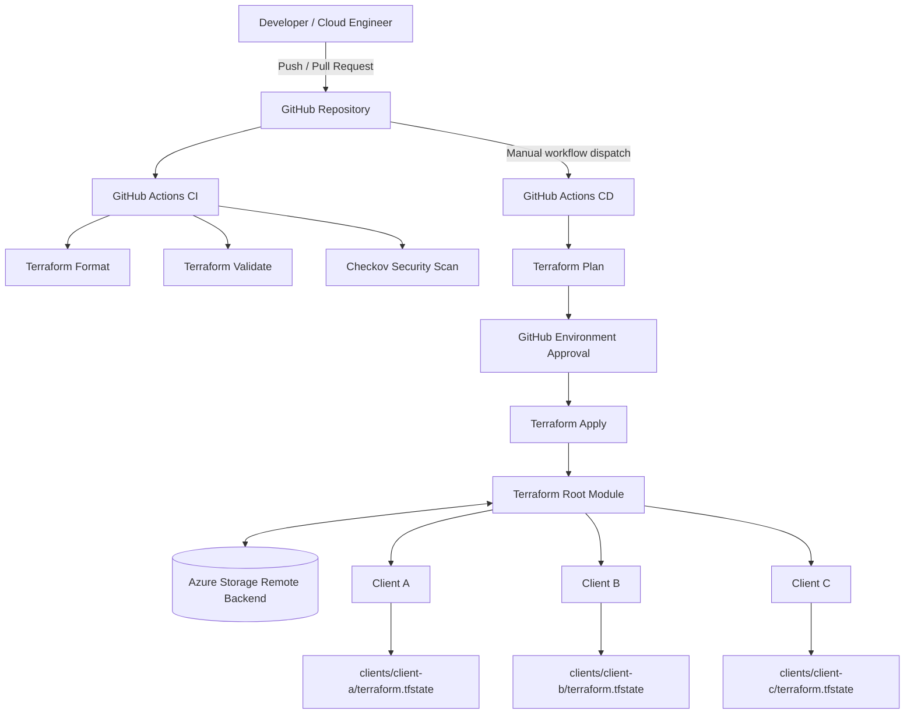
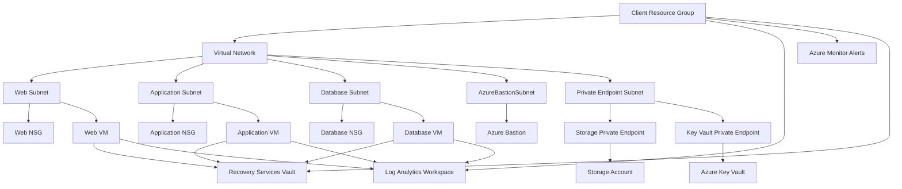
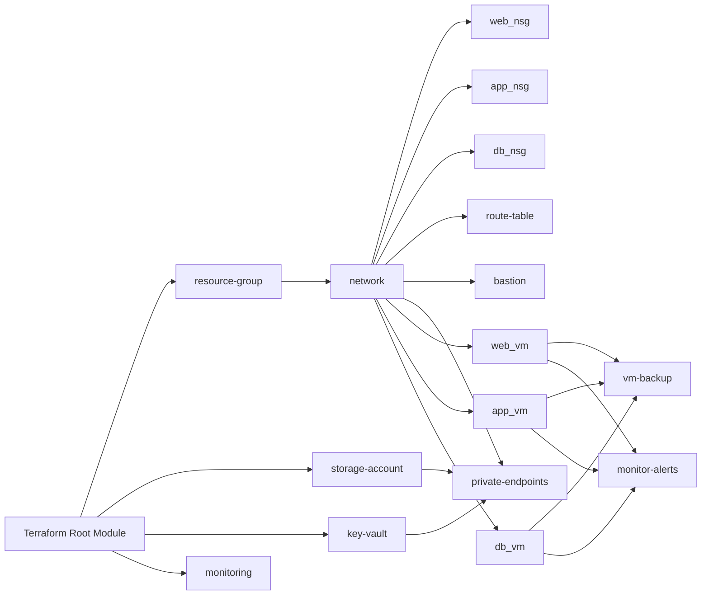

# 🚀 Terraform Multi-Tenant Azure Platform

> Enterprise-grade Microsoft Azure Landing Zone built with Terraform using reusable modules, isolated remote state, private networking, monitoring, backup, and Infrastructure as Code (IaC) best practices.


---

# 📖 Project Overview

This project demonstrates how to provision an **enterprise-grade multi-tenant Azure platform** using Terraform.

The infrastructure follows Infrastructure as Code (IaC) best practices by separating reusable Terraform modules from tenant-specific configurations. Every tenant has its own isolated Terraform state, allowing multiple customers to be managed from a single codebase safely.

This project is designed to simulate a real-world enterprise Azure environment and demonstrates modular Terraform development, secure networking, monitoring, backup, and private connectivity.

---

# ✨ Features

- Multi-Tenant Azure Platform
- Reusable Terraform Modules
- Remote Backend using Azure Storage Account
- Isolated Terraform State per Client
- Azure Resource Groups
- Virtual Network
- Network Security Groups (NSG)
- Route Tables
- Windows Virtual Machines
- Azure Bastion
- Azure Storage Account
- Azure Key Vault
- Azure Private Endpoints
- Azure Monitor
- Azure Log Analytics Workspace
- Azure Recovery Services Vault
- VM Backup Policy
- CPU Monitoring Alerts
- GitHub Ready
- GitHub Actions Ready
- Infrastructure as Code

---

# 🏗 Architecture

> Enterprise Azure Landing Zone

```
                              GitHub Repository
                                      │
                                      │
                         GitHub Actions (Future)
                                      │
                                      ▼
                           Terraform Root Module
                                      │
          ┌───────────────────────────┼────────────────────────────┐
          │                           │                            │
          ▼                           ▼                            ▼
      Client A                    Client B                     Client C
      tfvars                      tfvars                       tfvars
      backend                     backend                      backend
          │                           │                            │
          └──────────────┬────────────┴────────────┬───────────────┘
                         │
                         ▼
               Azure Remote Backend Storage
                     Terraform State Files
                         │
     ┌───────────────────┼───────────────────────────────┐
     │                   │                               │
     ▼                   ▼                               ▼
 Resource Group     Virtual Network               Storage Account
     │                   │
     ▼                   ▼
 Network Security Group  Route Table
     │
     ▼
 Windows Virtual Machines
     │
     ▼
 Azure Bastion
     │
     ▼
 Azure Key Vault
     │
     ▼
 Private Endpoints
     │
     ▼
 Log Analytics Workspace
     │
     ▼
 Azure Monitor Alerts
     │
     ▼
 Recovery Services Vault
```

---

# 📁 Project Structure

```
terraform-multi-tenant-azure-platform
│
├── .github
│   └── workflows
│
├── environments
│   ├── client-a
│   ├── client-b
│   └── client-c
│
├── modules
│   ├── bastion
│   ├── key-vault
│   ├── monitoring
│   ├── monitor-alerts
│   ├── network
│   ├── network-security-group
│   ├── private-endpoints
│   ├── resource-group
│   ├── route-table
│   ├── storage-account
│   ├── virtual-machine
│   └── vm-backup
│
├── diagrams
├── docs
├── scripts
│
├── backend.tf
├── provider.tf
├── variables.tf
├── locals.tf
├── outputs.tf
├── main.tf
├── versions.tf
└── README.md
```

---

# 🏢 Multi-Tenant Design

This project supports multiple customers from the same Terraform codebase.

| Client | Environment | Terraform State |
|---------|------------|-----------------|
| Client A | Production | clients/client-a/terraform.tfstate |
| Client B | Test | clients/client-b/terraform.tfstate |
| Client C | Development | clients/client-c/terraform.tfstate |

Each client maintains its own:

- Resource Group
- Virtual Network
- Virtual Machines
- Storage Account
- Key Vault
- Private Endpoints
- Bastion Host
- Log Analytics
- Backup Vault
- Terraform Remote State

This guarantees complete isolation between customers.

---

# 📦 Terraform Modules

| Module | Purpose |
|---------|----------|
| Resource Group | Creates Azure Resource Groups |
| Network | Creates Virtual Network and Subnets |
| Network Security Group | Configures NSGs |
| Route Table | Creates Route Tables |
| Storage Account | Creates Azure Storage Account |
| Virtual Machine | Deploys Windows Virtual Machines |
| Bastion | Secure VM Management |
| Key Vault | Secure Secret Management |
| Private Endpoints | Private Connectivity |
| Monitoring | Log Analytics Workspace |
| Monitor Alerts | CPU Alerts |
| VM Backup | Recovery Services Vault |

---

# 🔒 Security Features

This platform follows Azure security best practices.

- Azure Key Vault
- Azure Bastion
- Private Endpoints
- Network Security Groups
- Remote Terraform State
- Resource Isolation
- Tenant Isolation
- Secure Secret Management
- Infrastructure as Code

---

# 💾 Remote Backend

Terraform Remote State is stored inside Azure Storage Account.

Benefits include:

- State Locking
- Team Collaboration
- Remote Storage
- Version Control
- Consistency
- Safe Multi-Tenant Deployments

Each client uses an independent backend configuration.

Example:

```
clients/client-a/terraform.tfstate
clients/client-b/terraform.tfstate
clients/client-c/terraform.tfstate
```

---

# 🛠 Technologies Used

| Technology | Purpose |
|------------|---------|
| Microsoft Azure | Cloud Platform |
| Terraform | Infrastructure as Code |
| Azure CLI | Authentication |
| Git | Version Control |
| GitHub | Source Code Management |
| GitHub Actions | CI/CD (Future) |
| Visual Studio Code | Development |

---

# ⚡ Quick Start

Clone the repository

```bash
git clone https://github.com/saikrishna844/terraform-multi-tenant-azure-platform.git

cd terraform-multi-tenant-azure-platform
```

---

# 🚀 Deploy Client A

Initialize backend

```bash
terraform init \
-reconfigure \
-backend-config=environments/client-a/client-a.backend.hcl
```

Terraform Plan

```bash
terraform plan \
-var-file=environments/client-a/client-a.tfvars
```

Terraform Apply

```bash
terraform apply
```

---

# 🚀 Deploy Client B

```bash
terraform init \
-reconfigure \
-backend-config=environments/client-b/client-b.backend.hcl
```

```bash
terraform plan \
-var-file=environments/client-b/client-b.tfvars
```

```bash
terraform apply
```

---

# 🚀 Deploy Client C

```bash
terraform init \
-reconfigure \
-backend-config=environments/client-c/client-c.backend.hcl
```

```bash
terraform plan \
-var-file=environments/client-c/client-c.tfvars
```

```bash
terraform apply
```

---

# 📈 Monitoring

The platform includes:

- Azure Monitor
- Log Analytics Workspace
- CPU Alerts
- Diagnostic Settings
- VM Insights Ready

---

# 💾 Backup

Recovery Services Vault is configured for VM protection.

Features:

- Daily Backup Policy
- Recovery Services Vault
- VM Protection
- Enterprise Backup

---

# 🚀 CI/CD

GitHub Actions workflow (included):

- Terraform Format
- Terraform Validate
- Terraform Plan
- Terraform Apply (Future)
- Manual Approval (Future)

---

# 📚 Learning Outcomes

This project demonstrates practical experience with:

- Enterprise Terraform
- Azure Landing Zone
- Modular Terraform
- Remote Backend
- Terraform State Management
- Azure Networking
- Azure Security
- Azure Monitoring
- Azure Backup
- Multi-Tenant Infrastructure
- Infrastructure as Code
- GitHub Version Control
- GitHub Actions

---

# 🔮 Future Enhancements

- Azure DevOps Pipeline
- GitHub Actions Deployment
- Azure Firewall
- Azure Application Gateway
- Azure Front Door
- Azure Policy
- Azure Blueprints
- Terraform Cloud
- Cost Management
- Sentinel Policies
- AKS Deployment
- Azure Virtual WAN


# Azure Multi-Tenant Architecture

## Overview

This project demonstrates an enterprise-grade Azure Landing Zone using Terraform.

Each tenant has its own:

- Resource Group
- Virtual Network
- Subnets
- NSGs
- Route Tables
- Windows Virtual Machines
- Storage Account
- Key Vault
- Bastion
- Private Endpoints
- Azure Monitor
- Log Analytics
- Recovery Services Vault

Each tenant also maintains an independent Terraform state file.

---

## Architecture Flow

GitHub

↓

Terraform Root Module

↓

Reusable Terraform Modules

↓

Azure Resources

↓

Client A

↓

Client B

↓

Client C

---

## Benefits

- Modular Design
- Infrastructure as Code
- Easy Maintenance
- Tenant Isolation
- Enterprise Ready
2️⃣ Deployment-Guide.md
# Deployment Guide

## Clone Repository

```bash
git clone https://github.com/saikrishna844/terraform-multi-tenant-azure-platform.git
```

---

## Login Azure

```bash
az login
```

---

## Initialize Backend

```bash
terraform init \
-reconfigure \
-backend-config=environments/client-a/client-a.backend.hcl
```

---

## Plan

```bash
terraform plan \
-var-file=environments/client-a/client-a.tfvars
```

---

## Apply

```bash
terraform apply
```

---

## Destroy

```bash
terraform destroy
```
3️⃣ Modules.md
# Terraform Modules

## Resource Group

Creates Azure Resource Group.

---

## Network

Creates:

- VNet
- Subnets

---

## NSG

Creates Network Security Groups.

---

## Route Table

Creates Route Tables.

---

## Storage Account

Creates Azure Storage.

---

## Virtual Machine

Deploys Windows Virtual Machines.

---

## Bastion

Secure VM Access.

---

## Key Vault

Stores Secrets.

---

## Monitoring

Creates Log Analytics Workspace.

---

## Private Endpoint

Provides Private Connectivity.

---

## Backup

Creates Recovery Services Vault and Backup Policy.
4️⃣ Security.md
# Security Design

This project follows Azure Security Best Practices.

## Components

- Azure Key Vault
- Azure Bastion
- Private Endpoints
- Network Security Groups
- Remote Backend
- Separate Terraform States

## Benefits

- Secure Access
- Secret Management
- Private Connectivity
- Infrastructure Isolation
5️⃣ Troubleshooting.md
# Troubleshooting Guide

## Backend Configuration

Always use

terraform init -reconfigure

when switching clients.

---

## Separate State

Each client has its own backend.

Never use the wrong backend.

---

## Terraform Destroy Issue

If Client A resources appear while deploying Client B,

verify backend configuration.

---

## Recovery Services Vault

CloudInternalError

Retry deployment.

Sometimes Azure takes several minutes.

---

## Private Endpoint Errors

Verify subnet IDs.

Verify DNS links.

Verify Virtual Network IDs.

---

## Git Issues

Use separate Git repository.

Never expose

- tfstate
- tfvars
- backend files
6️⃣ Cost-Optimization.md
# Cost Optimization

## VM

Use B-Series VMs for labs.

---

## Bastion

Deploy only when required.

---

## Log Analytics

Reduce retention period.

---

## Backup

Protect only production VMs.

---

## Monitoring

Create only required alerts.

---

## Storage

Enable lifecycle management.
7️⃣ Interview-Guide.md
# Interview Questions

## Why Terraform Modules?

To improve reusability.

---

## Why Remote Backend?

For collaboration and state locking.

---

## Why Separate State?

To isolate tenants.

---

## Why Key Vault?

Secure secret management.

---

## Why Bastion?

Secure VM access.

---

## Why Private Endpoints?

Private communication inside Azure.

---

## Why Log Analytics?

Centralized monitoring.

---

## Why Azure Monitor?

Alerting and diagnostics.

---

## Why Recovery Services Vault?

VM Backup and Disaster Recovery.
8️⃣ Roadmap.md
# Project Roadmap

## Completed

- Azure Landing Zone
- Modular Terraform
- Multi-Tenant Architecture
- Remote Backend
- Monitoring
- Backup
- Private Endpoints
- Bastion
- Key Vault
- GitHub Repository

---

## Next Phase

- GitHub Actions CI/CD
- tfsec
- Checkov
- Terraform Docs
- Azure DevOps
- Azure Policy
- AKS
- Application Gateway


✅ Commit these files
git add docs
git commit -m "Add enterprise documentation for multi-tenant Azure platform"
git push

---

# Azure Multi-Tenant Platform Architecture

## Architecture Overview

This project deploys isolated Azure infrastructure for multiple clients from a
single reusable Terraform codebase.

Each client uses:

- A dedicated Azure resource group
- A dedicated virtual network
- Dedicated compute, storage and security resources
- A dedicated backend state key
- A dedicated variable file
- Independent Terraform lifecycle management

## Platform Architecture



## Per-Client Azure Architecture



## Module Dependency Flow



## Tenant State Isolation

 | Client | Backend key |
|---|---|
| Client A | `clients/client-a/terraform.tfstate` |
| Client B | `clients/client-b/terraform.tfstate` |
| Client C | `clients/client-c/terraform.tfstate` | 

Terraform must be reinitialized with the correct backend file before planning or
applying a different client.

## Deployment Sequence

1. Select the client.
2. Initialize the matching backend.
3. Verify the active backend state key.
4. Load the matching client variables.
5. Generate a saved Terraform plan.
6. Review the plan.
7. Confirm that no unrelated client resources will be destroyed.
8. Approve the protected GitHub environment.
9. Apply the saved plan.

# 👨‍💻 Author

**Sai Krishna**

**Azure Cloud Engineer | Terraform | DevOps | Infrastructure as Code**

GitHub

https://github.com/saikrishna844

---

## ⭐ If you found this project useful, don't forget to Star this repository.